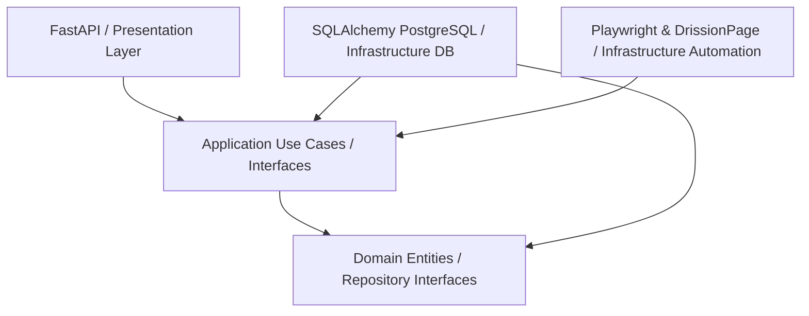
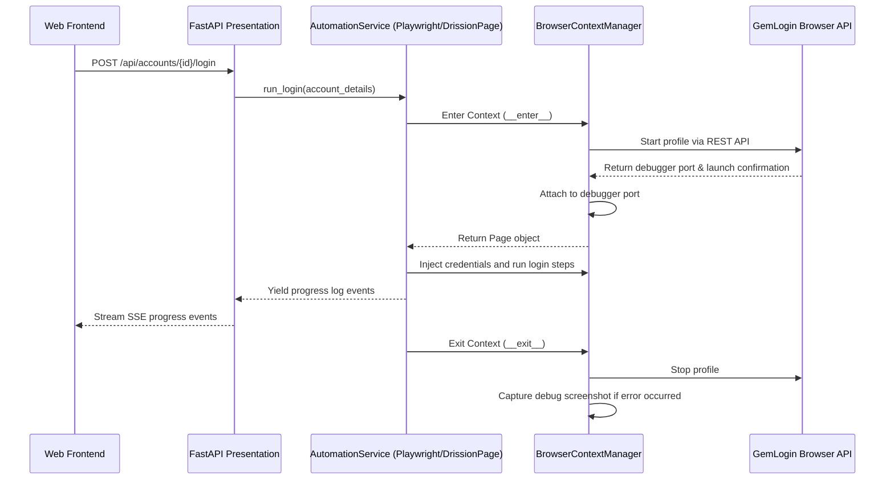

# Architecture Overview

This project is built using **Domain-Driven Design (DDD)** principles and **Clean Architecture** patterns, ensuring a decoupling of core business rules from external frameworks, database implementations, and browser automation drivers.

## Layer Structure

### 1. Domain Layer (`backend/app/domain`)
- **Entities**: Business objects representing the concepts of the domain (`Account`, `LoginHistory`).
- **Enums**: Core vocabulary constants (`Platform`, `LoginStatus`).
- **Repository Contracts**: Abstract interfaces specifying the required operations for persistence (`AccountRepository`, `LoginHistoryRepository`).
- **Rules**: Zero dependencies on FastAPI, SQLAlchemy, Playwright, or any other infrastructure framework.

### 2. Application Layer (`backend/app/application`)
- **Interfaces**: Abstract ports for external infrastructure like `BrowserContextManager` and `AutomationService`.
- **Use Cases**: Commands and orchestration logic. The app layer defines workflow routines like executing an automated login script and streaming progress.
- **Log Streaming**: Defines the structure and expectations of log messages returned by browser contexts.

### 3. Infrastructure Layer (`backend/app/infrastructure`)
- **Database Adapters**: Concrete SQL repository wrappers (`SQLAlchemyAccountRepository`, `SQLAlchemyLoginHistoryRepository`) implementing domain contracts.
- **Automation Adapters**: Automation services implementing application interfaces (`DrissionPageService`, `PlaywrightService`).
- **Browser Life Cycle Managers**: Subclasses of `BrowserContextManager` responsible for launching, running, and destroying browser processes (`GemLoginBrowser`, `LocalBrowser`, `PlaywrightBrowser`).

### 4. Presentation Layer (`backend/app/presentation`)
- **API Endpoints**: REST API endpoints for user actions, CRUD on accounts, and SSE log streaming.
- **Schemas**: Request/Response models mapped to FastAPI.
- **Middlewares**: CORS policies, error routing handlers.

---

## High-Level Sequence: Login Automation Flow

