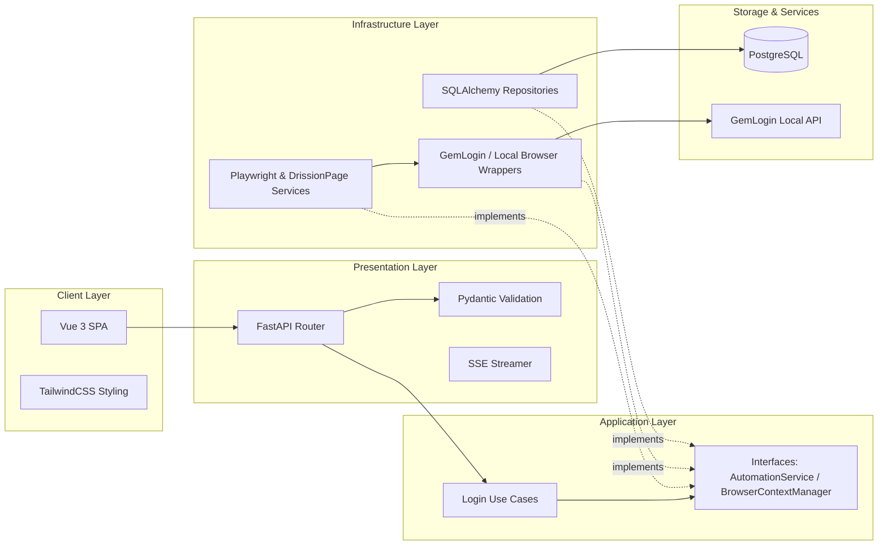

# RAG: Architecture Graph

A conceptual diagram representing the layer layout and boundaries.

```mermaid
graph LR
    subgraph Client Layer
        Vue[Vue 3 SPA]
        Tailwind[TailwindCSS Styling]
    end
    
    subgraph Presentation Layer
        Router[FastAPI Router]
        Schema[Pydantic Validation]
        SSE[SSE Streamer]
    end

    subgraph Application Layer
        Workflows[Login Use Cases]
        Ports[Interfaces: AutomationService / BrowserContextManager]
    end

    subgraph Infrastructure Layer
        Drivers[Playwright & DrissionPage Services]
        Browsers[GemLogin / Local Browser Wrappers]
        DB[SQLAlchemy Repositories]
    end

    subgraph Storage & Services
        Postgres[(PostgreSQL)]
        GemREST[GemLogin Local API]
    end

    Vue --> Router
    Router --> Schema
    Router --> Workflows
    Workflows --> Ports
    Drivers -. implements .-> Ports
    Browsers -. implements .-> Ports
    Drivers --> Browsers
    DB -. implements .-> Ports
    Browsers --> GemREST
    DB --> Postgres
```
