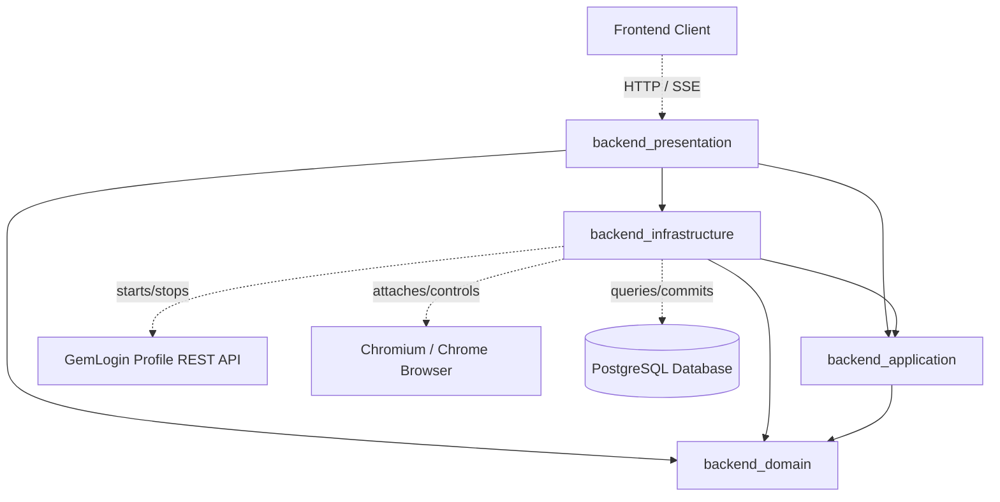

# RAG: Dependency Graph

The dependencies between system modules and external services are outlined below.

```mermaid
graph TD
    UI[Frontend Client] -. HTTP / SSE .-> presentation[backend_presentation]
    presentation --> infrastructure[backend_infrastructure]
    presentation --> application[backend_application]
    presentation --> domain[backend_domain]
    infrastructure --> application
    infrastructure --> domain
    application --> domain
    
    infrastructure -. starts/stops .-> GemLogin[GemLogin Profile REST API]
    infrastructure -. attaches/controls .-> Chrome[Chromium / Chrome Browser]
    infrastructure -. queries/commits .-> PostgreSQL[(PostgreSQL Database)]
```
