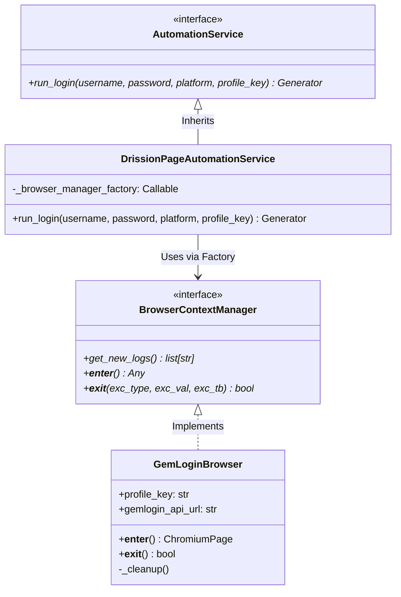

# Hướng dẫn Kỹ thuật: Refactoring Browser Automation & Dependency Injection

Tài liệu này hướng dẫn chi tiết về cấu trúc mã nguồn điều khiển trình duyệt tự động hóa sau khi được cải tiến. Nó giúp thành viên mới trong đội ngũ hiểu rõ về các mẫu thiết kế (Design Patterns), cách sử dụng và hướng dẫn mở rộng hệ thống sang các công cụ trình duyệt khác (GoLogin, ixBrowser, GinLogin,...).

---

## 1. Vấn đề trước khi Refactor

Trước đây, logic điều khiển trình duyệt thông qua **GemLogin API** và **DrissionPage** được viết gộp trực tiếp (inline) trong phương thức `run_login` của lớp `DrissionPageAutomationService`:
- **Vi phạm SRP (Single Responsibility Principle)**: Lớp dịch vụ đăng nhập vừa phải xử lý nghiệp vụ kịch bản (Facebook, YouTube,...), vừa phải lo thiết lập cổng debug, gọi API khởi động/tắt trình duyệt, chụp ảnh màn hình.
- **Khó mở rộng (Tight Coupling)**: Khởi tạo trực tiếp (gọi `new`) cụ thể `GemLoginBrowser` bên trong dịch vụ. Khi cần chuyển đổi sang các nhà cung cấp profile khác như GoLogin hay ixBrowser, ta bắt buộc phải chỉnh sửa sâu vào mã nguồn lõi của lớp dịch vụ.
- **Quản lý tài nguyên phức tạp**: Phụ thuộc vào các khối `try/except/finally` thủ công dễ sót lỗi dẫn đến việc rò rỉ (leak) tiến trình trình duyệt ngầm trên hệ thống khi có lỗi đột ngột.

---

## 2. Giải pháp Cải tiến & Kiến trúc Mới

Hệ thống được thiết kế lại dựa trên nguyên lý **Dependency Inversion Principle (DIP)** và cơ chế **Context Manager (with statement)** của Python.



### 2.1 Định nghĩa Interface chung: `BrowserContextManager`
Nằm trong [interfaces.py](file:///Users/kyle/Desktop/Automation_SocialMedia-main/backend/app/application/interfaces.py). Tất cả các bộ quản lý trình duyệt sau này đều phải triển khai interface trừu tượng này:

```python
from abc import ABC, abstractmethod
from typing import Any

class BrowserContextManager(ABC):
    @abstractmethod
    def get_new_logs(self) -> list[str]:
        """Trả về các dòng logs mới tích lũy kể từ lần gọi trước."""
        pass

    @abstractmethod
    def __enter__(self) -> Any:
        """Kích hoạt và khởi tạo trình duyệt. Trả về đối tượng page (ví dụ: ChromiumPage)."""
        pass

    @abstractmethod
    def __exit__(self, exc_type: type[BaseException] | None, exc_val: BaseException | None, exc_tb: Any) -> bool:
        """Đóng trình duyệt, giải phóng tài nguyên khi thoát khỏi khối 'with'."""
        pass
```

### 2.2 Tách biệt logic quản lý trình duyệt: `GemLoginBrowser`
Nằm trong [gemlogin_browser.py](file:///Users/kyle/Desktop/Automation_SocialMedia-main/backend/app/infrastructure/automation/gemlogin_browser.py). Lớp này kế thừa `BrowserContextManager` chịu trách nhiệm duy nhất về tương tác API GemLogin và quản lý tiến trình ChromiumPage:
- **`__enter__`**: Thực hiện tìm kiếm profile ID theo tên, gọi API mở profile lấy debug port, khởi tạo DrissionPage kết nối đến port đó.
- **`__exit__`**: Đảm bảo chụp ảnh màn hình lưu vào thư mục `screenshots`, gọi API đóng profile, đóng tiến trình trình duyệt sạch sẽ bằng `page.quit()`.
- **Tối ưu hóa nội bộ**: Mã nguồn được phân rã thành các phương thức đơn nhiệm rõ ràng giúp dễ bảo trì và đọc hiểu.

### 2.3 Áp dụng Dependency Injection (DI)
Nằm trong [drission_page.py](file:///Users/kyle/Desktop/Automation_SocialMedia-main/backend/app/infrastructure/automation/drission_page.py). Lớp dịch vụ chính nhận vào một **factory function** sinh ra đối tượng `BrowserContextManager` thay vì tự ý tạo mới:

```python
class DrissionPageAutomationService(AutomationService):
    def __init__(self, browser_manager_factory: Callable[[str], BrowserContextManager] | None = None):
        # Fallback sử dụng GemLogin làm mặc định nếu không truyền factory từ ngoài
        self._browser_manager_factory = browser_manager_factory or default_browser_manager_factory
```

Nhờ vậy, thân hàm kịch bản tự động hóa cực kỳ ngắn gọn và trực quan:
```python
    def run_login(self, username, password, platform, profile_key):
        # Khởi tạo trình duyệt thông qua factory được inject vào
        browser_manager = self._browser_manager_factory(profile_key)
        
        try:
            with browser_manager as page:
                # Thu thập logs khởi động của trình duyệt
                for log_msg in browser_manager.get_new_logs():
                    yield log(log_msg)
                
                # Thực thi kịch bản đăng nhập theo nền tảng
                if platform == Platform.FACEBOOK:
                    final_status_val = yield from login_facebook(page, username, password, log)
                ...
        except Exception as e:
            # Lấy nốt logs lỗi phát sinh trong lúc chạy
            for log_msg in browser_manager.get_new_logs():
                yield log(log_msg)
            yield log(f"Lỗi: {e}")
        finally:
            # Đảm bảo yield toàn bộ log dọn dẹp trình duyệt (từ __exit__)
            for log_msg in browser_manager.get_new_logs():
                yield log(log_msg)
```

### 2.4 Lưu ý quan trọng về cách hoạt động của Context Manager qua Factory

> [!NOTE]
> **Câu hỏi thực tế:** Hàm `default_browser_manager_factory` đang khởi tạo và trả về một đối tượng mới (`new class instance`). Vậy cơ chế Context Manager (`with` statement) có hoạt động không?

**Câu trả lời là CÓ.** Cơ chế hoạt động chi tiết như sau:
1. **Khởi tạo đối tượng (Instance) thay vì lớp (Class):**
   Hàm `default_browser_manager_factory` thực hiện việc khởi tạo và trả về một **thực thể (instance)** của lớp `GemLoginBrowser` (ví dụ: `return GemLoginBrowser(...)`).
2. **Kế thừa và Triển khai Giao thức:**
   Bản thân đối tượng được trả về này kế thừa từ `BrowserContextManager` và có cài đặt hai phương thức bắt buộc của giao thức Context Manager trong Python là `__enter__` và `__exit__`.
3. **Kích hoạt tại khối `with`:**
   Tại dòng code:
   ```python
   browser_manager = self._browser_manager_factory(profile_key)
   with browser_manager as page:
       ...
   ```
   Lúc này, `browser_manager` đang chứa thực thể vừa được factory tạo ra. Khi câu lệnh `with browser_manager` được thực thi, Python sẽ tự động gọi phương thức `__enter__()` của thực thể đó để mở trình duyệt và trả về `page` (đối tượng page của DrissionPage). Khi khối code bên trong kết thúc (hoặc xảy ra ngoại lệ), Python sẽ tự động gọi phương thức `__exit__()` của thực thể đó để thực hiện dọn dẹp (tắt trình duyệt, chụp ảnh màn hình,...).

Do đó, việc khởi tạo qua Factory hoàn toàn không ảnh hưởng đến hoạt động của Context Manager, mà ngược lại giúp đảm bảo tính đa hình (Polymorphism) và giải phóng tài nguyên một cách an toàn.

---


## 3. Cách Phát triển Thêm Trình duyệt Mới

### 3.1 Ví dụ Tích hợp qua API của Bên Thứ Ba (GoLogin)

Khi dự án yêu cầu tích hợp thêm GoLogin, quy trình thực hiện như sau:

#### Bước 1: Tạo class manager mới kế thừa `BrowserContextManager`
Ví dụ tạo file `app/infrastructure/automation/gologin_browser.py`:
```python
from app.application.interfaces import BrowserContextManager

class GoLoginBrowser(BrowserContextManager):
    def __init__(self, profile_key: str, token: str, profile_id: str):
        self.profile_key = profile_key
        self.token = token
        self.profile_id = profile_id
        self._logs = []
        self.page = None

    def log(self, msg: str):
        self._logs.append(msg)

    def get_new_logs(self) -> list[str]:
        # Trả về các dòng log mới
        ...

    def __enter__(self):
        self.log("Đang khởi tạo GoLogin...")
        # Gọi SDK/API của GoLogin để mở profile và lấy port
        # Khởi tạo ChromiumPage với port đó
        return self.page

    def __exit__(self, exc_type, exc_val, exc_tb):
        # Đóng profile GoLogin, giải phóng ChromiumPage
        return False
```

#### Bước 2: Định nghĩa factory và Inject vào khi sử dụng
Trong mã nguồn API hoặc nơi điều phối luồng:
```python
def make_gologin_browser(profile_key: str) -> BrowserContextManager:
    return GoLoginBrowser(
        profile_key=profile_key,
        token="MY_GOLOGIN_TOKEN",
        profile_id="gologin_profile_123"
    )

# Khởi tạo kịch bản tự động hóa sử dụng GoLogin thay vì mặc định GemLogin
automation_service = DrissionPageAutomationService(browser_manager_factory=make_gologin_browser)
```
*Lưu ý: Kịch bản automation của Facebook, Youtube,... không cần thay đổi bất kỳ dòng code nào!*

### 3.2 Ví dụ Khởi chạy Trình duyệt Thuần Local qua Dòng Lệnh (LocalBrowser)

Trong một số trường hợp, bạn không muốn sử dụng API profile bên thứ ba mà chỉ cần khởi chạy trình duyệt Google Chrome local có sẵn trên máy bằng dòng lệnh (Command Line Subprocess), mở cổng debug và tắt tiến trình này khi kết thúc.

Lớp `LocalBrowser` triển khai giao diện `BrowserContextManager` như sau (nằm tại [local_browser.py](file:///Users/kyle/Desktop/Automation_SocialMedia-main/backend/app/infrastructure/automation/local_browser.py)):

```python
import subprocess
import time
from pathlib import Path
from typing import Any
from DrissionPage import ChromiumPage, ChromiumOptions
from app.application.interfaces import BrowserContextManager

class LocalBrowser(BrowserContextManager):
    """
    Context manager để tự động chạy trình duyệt Chrome local bằng dòng lệnh.
    """
    def __init__(
        self,
        profile_key: str,
        chrome_path: str = "/Applications/Google Chrome.app/Contents/MacOS/Google Chrome",
        port: int = 9222,
        user_data_dir: str | None = None
    ):
        self.profile_key = profile_key
        self.chrome_path = chrome_path
        self.port = port
        
        # Thiết lập thư mục profile tạm thời cho session
        backend_dir = Path(__file__).resolve().parents[3]
        self.user_data_dir = Path(user_data_dir) if user_data_dir else (backend_dir / "profiles" / f"local_{profile_key}")
        
        self.page = None
        self.process = None
        self._logs = []
        self._log_index = 0

    def log(self, msg: str):
        self._logs.append(msg)

    def get_new_logs(self) -> list[str]:
        new_logs = self._logs[self._log_index:]
        self._log_index = len(self._logs)
        return new_logs

    def __enter__(self) -> ChromiumPage:
        try:
            self.log(f"Chuẩn bị thư mục profile tại: {self.user_data_dir}")
            self.user_data_dir.mkdir(parents=True, exist_ok=True)

            self.log("Khởi chạy tiến trình Chrome bằng subprocess...")
            args = [
                self.chrome_path,
                f"--remote-debugging-port={self.port}",
                f"--user-data-dir={self.user_data_dir}",
                "--no-first-run",
                "--no-default-browser-check"
            ]
            self.process = subprocess.Popen(args, stdout=subprocess.DEVNULL, stderr=subprocess.DEVNULL)
            
            time.sleep(2) # Chờ trình duyệt sẵn sàng

            co = ChromiumOptions()
            co.set_local_port(self.port)
            self.page = ChromiumPage(addr_or_opts=co)
            return self.page
        except Exception as e:
            self._cleanup()
            raise e

    def _cleanup(self):
        if self.page:
            # Chụp ảnh màn hình lưu vết lỗi/thành công
            # ...
            try:
                self.page.quit()
            except:
                pass
        
        if self.process:
            self.log("Gửi tín hiệu tắt tiến trình Chrome...")
            try:
                self.process.terminate()
                self.process.wait(timeout=5)
            except subprocess.TimeoutExpired:
                self.log("Chrome không tắt, tiến hành ép buộc kill...")
                self.process.kill()
                self.process.wait()

    def __exit__(self, exc_type, exc_val, exc_tb):
        self._cleanup()
        return False
```

#### Inject và Sử dụng:
```python
def local_browser_factory(profile_key: str) -> BrowserContextManager:
    return LocalBrowser(
        profile_key=profile_key,
        chrome_path="/usr/bin/google-chrome",  # Đường dẫn Chrome trên Linux/VPS
        port=9222
    )

# Inject vào service kịch bản tự động hóa
automation_service = DrissionPageAutomationService(browser_manager_factory=local_browser_factory)
```


---

## 4. Hướng dẫn Chạy Kiểm thử (Testing)

Ta sử dụng kỹ thuật Mocking để viết kiểm thử cô lập mà không cần dịch vụ PostgreSQL hay công cụ GemLogin/GoLogin thật đang hoạt động.

Xem file kịch bản mẫu tại [test_gemlogin_browser.py](file:///Users/kyle/.gemini/antigravity-ide/brain/daad858c-9472-4203-84bf-7cd843eb79b6/scratch/test_gemlogin_browser.py):
- Chạy lệnh test trên máy local:
  ```bash
  .venv/bin/python test_gemlogin_browser.py
  ```
- Kiểm thử bao gồm xác minh việc tự động đóng trình duyệt khi gặp lỗi (`test_context_manager_success`) và kiểm tra tính đúng đắn của cơ chế Dependency Injection (`test_drission_page_dependency_injection`).
