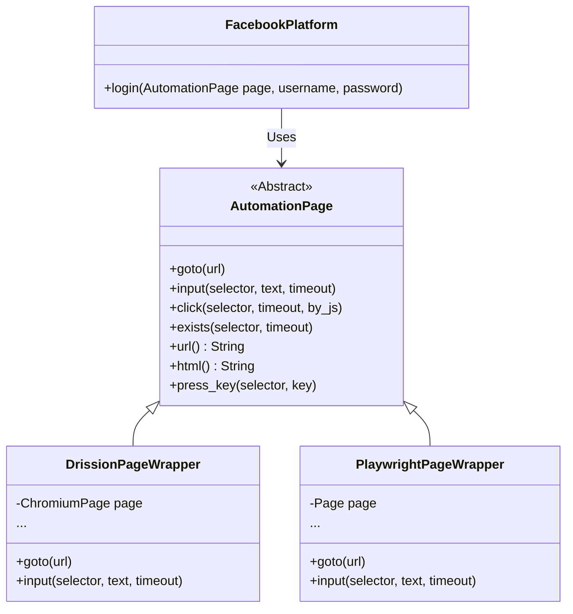

<!-- File path: docs/plans/001_driver_agnostic_platform_actions.md -->

# Implementation Plan – Driver-Agnostic Browser Automation Refactoring (Adapter Pattern)

## 1. Overview
- **Feature Name**: Driver-Agnostic Browser Automation Wrapper (Adapter Pattern)
- **Business Objective**: Reduce code maintenance cost and eliminate duplication by 50% in the social media automation engine. Allow rapid onboarding of new browser engines (e.g. Pyppeteer/Selenium) without replicating platform scripts.
- **Technical Objective**: Refactor the browser automation module by introducing an abstract browser page wrapper interface (`AutomationPage`). Consolidate browser-specific platform actions (Facebook, YouTube, TikTok, Twitter) into a single, unified module that depends solely on this abstraction, implementing the Adapter pattern.
- **Expected Outcome**: Platforms logic is written once in a driver-agnostic manner. `platforms_drissionpage` and `platforms_playwright` directories are deleted and replaced by a single `platforms` directory.

---

## 2. Memory Consultation Summary
- **Memory Confidence**: High (Memory was bootstrapped today, and no code changes have occurred since then).
- **Memory Documents Read**:
  - `project-summary.md` (technology stack details, folder conventions, modules)
  - `architecture/overview.md` (Clean Architecture layers, SSE sequence workflow)
  - `architecture/browser.md` (interfaces, BrowserContextManager, DrissionPage vs Playwright drivers)
  - `modules/backend_infrastructure.md` (lists automation services, folder locations)
- **RAG Query Used**: N/A (Inspected memory files directly due to high confidence).
- **Additional Source Files Inspected**:
  - `backend/app/infrastructure/automation/platforms_drissionpage/facebook.py` (to analyze DrissionPage selector syntax and element interactions)
  - `backend/app/infrastructure/automation/platforms_playwright/facebook.py` (to analyze Playwright selector syntax and element interactions)
- **Key Architectural Findings**:
  - The login actions on Facebook are functionally identical across Playwright and DrissionPage (visit homepage -> check if logged in -> input user/pass -> click login button -> wait for 2FA or home feed).
  - The only differences are framework-specific syntax calls (e.g., `page.get()` vs `page.goto()`, `page.ele()` vs `page.locator()`, `element.input()` vs `locator.fill()`).
  - Wrapping these calls in a unified interface keeps platform actions pure and driver-independent.

---

## 3. Current Architecture
- **Current Modules**: `backend_infrastructure` governs all automation tasks under `backend/app/infrastructure/automation`.
- **Current Responsibilities**:
  - `platforms_drissionpage/`: Contains scripts for Facebook, TikTok, Twitter, YouTube utilizing DrissionPage's ChromiumPage/Tab commands.
  - `platforms_playwright/`: Contains parallel files performing the exact same logic but utilizing Playwright's Page commands.
  - `drission_page.py` and `playwright_service.py`: Import from their respective platforms folders and run them.
- **Existing Limitations**:
  - Violates the DRY (Don't Repeat Yourself) principle. Any change to a platform's login script (e.g. selector updates due to UI changes on Facebook) must be copied manually in two places.
  - Hard to scale: Adding a third driver (e.g., Pyppeteer) requires copying all social login scripts a third time.
- **Opportunities for Reuse**:
  - The sequential logic (the flow of actions, sleep times, logs yielded, and expected redirects) is 100% reusable and should be extracted.

---

## 4. Scope

### In Scope
- Creating the abstract `AutomationPage` wrapper interface in a new file `page_wrapper.py`.
- Implementing `DrissionPageWrapper` and `PlaywrightPageWrapper` subclasses concrete adapters.
- Consolidating platform actions into `backend/app/infrastructure/automation/platforms/` containing `facebook.py`, `youtube.py`, `tiktok.py`, and `twitter.py`.
- Refactoring `DrissionPageService` and `PlaywrightService` to wrap native page objects and invoke the new shared scripts.
- Removing duplicate `platforms_drissionpage` and `platforms_playwright` directories.
- Verifying the refactoring via integration testing.

### Out of Scope
- Writing concrete implementation files for Puppeteer/Pyppeteer (this refactoring only lays the foundation).
- Modifying presentation schemas, endpoints, or DB storage tables.

### Assumptions
- A generic element selector strategy (like standard CSS selectors) is supported by both DrissionPage and Playwright, allowing us to pass the same locators in the unified scripts.
- Page polling behaviors can be standardized into common functions on the page wrapper.

---

## 5. Proposed Solution
We will implement the **Adapter Pattern** to standardize page interactions:

The unified social media scripts in `platforms/` will interact only with the `AutomationPage` interface. 

---

## 6. Architecture Impact
- **Affected Layers**: Infrastructure Layer (`backend_infrastructure`) only.
- **Affected Modules**: `backend/app/infrastructure/automation`.
- **Interfaces Required**: A new `AutomationPage` abstract class.
- **Data Flow Changes**: No changes in parameters. When a login is requested, the native driver page is created inside the context manager, wrapped in the respective adapter, and passed to the platform runner.
- **Dependency Boundaries**: Removes the direct dependencies of platform actions on Playwright (`playwright.sync_api.Page`) or DrissionPage (`DrissionPage.ChromiumPage`).

---

## 7. File Impact Analysis

### Create
- **`backend/app/infrastructure/automation/page_wrapper.py`**:
  - Responsibility: Defines the abstract `AutomationPage` interface and contains the implementations of `DrissionPageWrapper` and `PlaywrightPageWrapper`.
  - Complexity: Medium. Must handle mapping Playwright's locator methods and DrissionPage's `.ele` search logic correctly.
- **`backend/app/infrastructure/automation/platforms/`** (Directory containing consolidated scripts):
  - `facebook.py`, `youtube.py`, `tiktok.py`, `twitter.py`:
    - Responsibility: Consolidated, driver-agnostic login scripts.
    - Complexity: Medium. Merge logic from existing duplicates and adapt to the `AutomationPage` API.

### Modify
- **`backend/app/infrastructure/automation/drission_page.py`**:
  - Responsibility: Wrap `ChromiumPage` inside `DrissionPageWrapper` and import/execute the unified platform script.
  - Complexity: Low.
- **`backend/app/infrastructure/automation/playwright_service.py`**:
  - Responsibility: Wrap Playwright `Page` inside `PlaywrightPageWrapper` and import/execute the unified platform script.
  - Complexity: Low.

### Delete
- **`backend/app/infrastructure/automation/platforms_drissionpage/`** (directory and all contained files).
- **`backend/app/infrastructure/automation/platforms_playwright/`** (directory and all contained files).

---

## 8. Implementation Phases

### Phase 1: Core Abstraction & Adapters
- **Objective**: Create `AutomationPage` and its concrete implementations.
- **Files Involved**: `backend/app/infrastructure/automation/page_wrapper.py`.
- **Expected Result**: A file defining the contract and concrete wrappers for Playwright and DrissionPage.
- **Validation**: Write a simple scratch script to verify navigation and element searching on a dummy page using both adapters.

### Phase 2: Platform Logic Consolidation
- **Objective**: Merge scripts into the driver-agnostic `platforms/` folder.
- **Files Involved**:
  - Create: `backend/app/infrastructure/automation/platforms/facebook.py` (and others).
  - Delete: old folders.
- **Expected Result**: Clean, driver-agnostic platforms scripts that accept `AutomationPage` instead of native page objects.

### Phase 3: Service Hookup & Clean up
- **Objective**: Refactor service files to use the adapters and clean up the workspace.
- **Files Involved**:
  - `backend/app/infrastructure/automation/drission_page.py`
  - `backend/app/infrastructure/automation/playwright_service.py`
- **Expected Result**: Both services run their automation routines using the new adapters and unified scripts.

---

## 9. Testing Strategy
- **Unit Testing**:
  - Write test mocks for the `AutomationPage` interface to verify that platform automation scripts invoke the correct sequence of clicks, typing, and navigations.
- **Integration Testing**:
  - Run the integration test suite: `python backend/test_automation.py` using both `AUTOMATION_PROVIDER=playwright` and `AUTOMATION_PROVIDER=drissionpage` in `.env` to verify login workflows execute correctly.

---

## 10. Risks
- **Risk 1: Syntax / Locator differences**: DrissionPage uses custom element syntax (e.g. `css:button` or `text:Login`) whereas Playwright uses standard CSS/XPath selectors.
  - *Impact*: Medium. Some platform scripts might fail if locators behave differently.
  - *Mitigation*: The page wrappers will normalize the selector prefixes (e.g., stripping `css:` when passing to Playwright, or dynamically adapting queries).
- **Risk 2: Multi-tab/Pop-up handling**: DrissionPage handles tabs as separate objects, while Playwright uses contexts and pages.
  - *Impact*: Low (current platforms do not use popups for standard logins).
  - *Mitigation*: Include basic page-context switches inside `AutomationPage` if required in future.

---

## 11. Acceptance Criteria
- [ ] `page_wrapper.py` successfully implemented and includes adapters for both frameworks.
- [ ] Shared platforms scripts created in `backend/app/infrastructure/automation/platforms/`.
- [ ] Old platforms directories deleted.
- [ ] Integration tests pass for both `playwright` and `drissionpage` providers.
- [ ] Code duplication in platforms actions reduced to zero.

---

## 12. Future Extensions
- **Puppeteer/Pyppeteer support**: Easily create `PyppeteerPageWrapper` to support puppeteer control in the system.
- **Action Recorder**: Generate driver-agnostic JSON kịch bản (JSON action scripts) that can be parsed by `AutomationPage` to run customizable actions.
