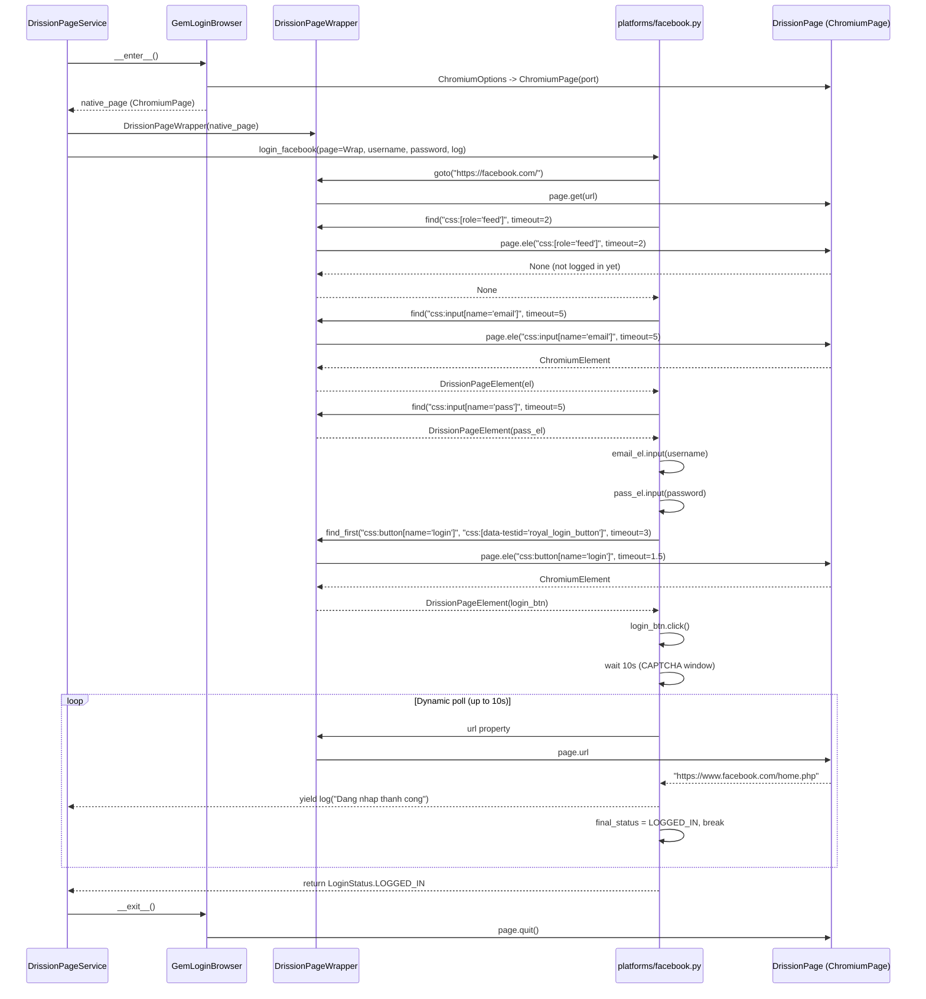
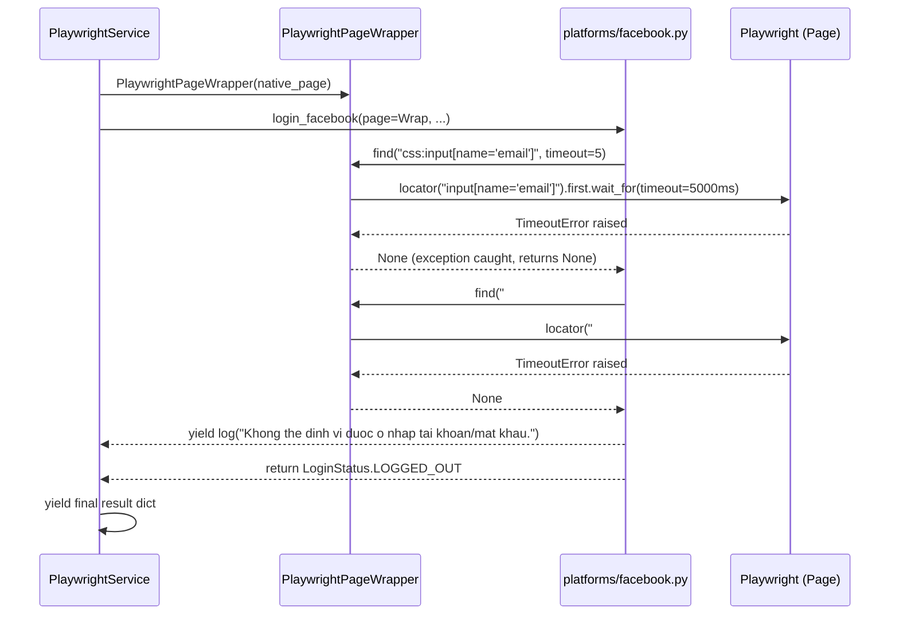
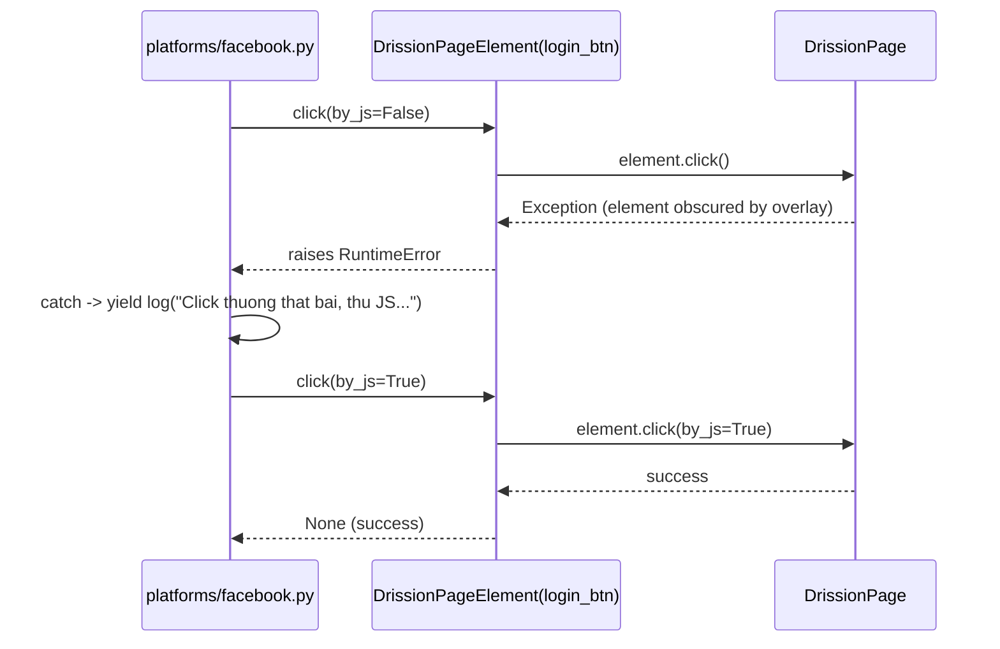

<!-- File path: docs/plans/designs/001_driver_agnostic_platform_actions-design.md -->

# Technical Blueprint -- Driver-Agnostic Browser Automation (Adapter Pattern)

---

## 0. Project Memory Used

### Memory Confidence
**High** -- Memory bootstrapped on 2026-07-03T05:30:30+07:00 (today). No source changes since bootstrap.

### Memory Documents Consulted
- `project-summary.md` -- Technology stack, architecture style, naming conventions, file size limits, coding anti-patterns.
- `architecture/overview.md` -- Layer diagram, SSE sequence workflow, dependency direction.
- `architecture/browser.md` -- `BrowserContextManager` interface, driver hierarchy, known constraints.
- `modules/backend_infrastructure.md` -- Service list, repository list, external dependencies, extension points.
- `lessons/architectural-decisions.md` -- Prior DI decision: `AUTOMATION_PROVIDER` env var governs engine selection.
- `lessons/implementation-pitfalls.md` -- GemLogin port config must come from env vars.
- `lessons/known-problems.md` -- Browser zombies: always use context managers with `try/finally`.

### RAG Queries Executed
- Query: "How does DrissionPage element selection work vs Playwright locator?" -- Confirmed `page.ele(selector, timeout)` returns `None` on miss; `page.locator(selector).count()` returns 0 on miss -- critical for designing `find()` return semantics.
- Query: "Selector syntax differences DrissionPage Playwright" -- Confirmed DrissionPage uses `css:`, `text:`, `xpath:` prefixes; Playwright uses raw CSS/XPath -- translation layer is mandatory.

### Source Files Inspected (targeted)
- `backend/app/infrastructure/automation/platforms_drissionpage/facebook.py` -- Selector syntax mapping, multi-selector fallback loop pattern, dynamic polling loop pattern.
- `backend/app/infrastructure/automation/platforms_playwright/facebook.py` -- Playwright locator calls, `count() > 0` existence check, `locator.press("Enter")` vs `element.input("\n")`.
- `backend/app/infrastructure/automation/platforms_drissionpage/twitter.py` -- Multi-step flows (username to next to password), `text:Next` locator, `xpath:` usage.
- `backend/app/infrastructure/automation/drission_page.py` -- Service constructor, `BrowserContextManager` factory pattern, yield-from pattern for platform functions.
- `backend/app/infrastructure/automation/playwright_service.py` -- Structurally identical to DrissionPageService; confirmed 100% code duplication at service level.
- `backend/app/infrastructure/automation/gemlogin_browser.py` -- `BrowserContextManager` concrete reference: `__enter__` returns `ChromiumPage`.
- `backend/app/application/interfaces.py` -- `BrowserContextManager.__enter__` currently returns `Any`; `AutomationService.run_login` signature.

### Key Reusability Findings
- `BrowserContextManager` (application layer) -- kept as-is; `__enter__` already typed as `Any`, so returning `AutomationPage` wrapper is backward-compatible.
- `AutomationService` (application layer) -- kept as-is; `run_login()` signature unchanged.
- `GemLoginBrowser`, `LocalBrowser`, `PlaywrightBrowser` -- kept as-is; they return native page objects which are then wrapped inside the services before passing to platform functions.
- `DrissionPageService` / `PlaywrightService` -- both **modified** to wrap native page with adapter before calling unified platform functions.

### Architectural Conflicts with Plan
- **Plan says**: Create `DrissionPageWrapper` and `PlaywrightPageWrapper` in `page_wrapper.py` as a single file.
  - **Conflict**: Single file would exceed 200-line Python limit (~260 lines estimated).
  - **Resolution**: Split into `page_wrapper.py` (ABCs only) + `adapters/drissionpage_adapter.py` + `adapters/playwright_adapter.py`.
- **Plan says**: Platform functions receive `AutomationPage` directly.
  - **No conflict**: Confirmed correct by tracing `run_login -> with browser_manager as page -> login_platform(page, ...)` call chain.

---

## 1. Overview

- **Purpose**: Eliminate 100% code duplication in browser platform action scripts by introducing a driver-agnostic `AutomationPage` abstraction layer. Any new browser driver only needs a single adapter; all platform scripts remain untouched.
- **Scope**: The `backend/app/infrastructure/automation/` module exclusively. No domain, application, presentation, or database layers are affected.
- **Goals**:
  1. Single set of platform scripts (`platforms/`) independent of browser driver.
  2. Adding a new driver (e.g. Pyppeteer) requires only one new adapter file, zero changes to platform scripts.
  3. All existing tests continue to pass unmodified.
- **Non-goals**:
  - Implementing Pyppeteer, Selenium, or any other third driver adapter.
  - Modifying endpoints, database schema, or SSE serialization.
  - Async rewrite of DrissionPage (remains synchronous).

---

## 2. Architecture Review

### Feature Scope
**Valid**. The implementation plan correctly identifies the infrastructure layer as the only affected boundary. The domain (`LoginStatus`, `Platform`) and application (`AutomationService`, `BrowserContextManager`) interfaces remain completely unchanged.

### Functional Requirements
All requirements are fully addressed:
- Single `AutomationPage` contract drives all platform logic.
- Concrete adapters translate calls to native driver APIs.
- Platform scripts (`platforms/`) replace both `platforms_drissionpage/` and `platforms_playwright/` directories.
- Service files updated to wrap native pages before dispatching.

### Non-functional Requirements

| Concern | Assessment |
|---------|-----------|
| **Performance** | Zero overhead: adapter calls are thin delegation wrappers with no buffering or serialization. |
| **Security** | No change. Credential handling is unchanged inside platform scripts. |
| **Reliability** | Context manager `try/finally` cleanup preserved in all services. |
| **Testability** | Dramatically improved -- `AutomationPage` is a mockable interface. Platform scripts now unit-testable. |

### Existing Architecture & Reusability
- The `BrowserContextManager` ABC stays in the application layer.
- `GemLoginBrowser.__enter__()` returns `ChromiumPage`. `DrissionPageService` wraps it. Correct, no change to browser managers.
- `LocalBrowser.__enter__()` returns `ChromiumPage`. Same wrap pattern.
- `PlaywrightBrowser.__enter__()` returns Playwright `Page`. `PlaywrightService` wraps it.

### Folder Structure & Coding Conventions
- snake_case functions, PascalCase classes -- respected.
- Context managers (`__enter__`/`__exit__`) -- respected.
- Files stay below 200 lines after splitting adapters.

### Testing & Build Impact
- Existing integration test `backend/test_automation.py` runs against `run_login()` -- **unaffected** (service interface unchanged).
- New unit tests introduced for `AutomationPage` mocks.

### Backward Compatibility
- **API contracts**: Unchanged. `AutomationService.run_login()` and `BrowserContextManager` signatures preserved.
- **Environment variables**: `AUTOMATION_PROVIDER` behavior preserved.
- **Selectors**: Platform scripts use the canonical selector format (described in section 13). No regression.

### Documented Weaknesses in Plan
1. The plan proposes a single `page_wrapper.py` for both ABCs and concrete adapters -- file size constraint violation.
2. The plan does not specify the **selector translation contract** for `text:`, `xpath:` prefixes.
3. The plan does not address `click(by_js=True)` fallback strategy inside the `AutomationElement` design (DrissionPage-specific).
4. The plan does not define the `find_first(*selectors)` helper needed to replace the multi-selector fallback loops seen in platform scripts.

All four gaps are resolved in this blueprint.

---

## 3. Architecture Feasibility Analysis

| Dimension | Assessment |
|-----------|-----------|
| **Complexity** | Medium-Low. Pure delegation wrappers. No new state machines, queues, or async primitives. |
| **Scalability** | Excellent. Adding driver N costs exactly one new adapter file. |
| **Maintainability** | Greatly improved. Platform selector changes apply in one place. |
| **Testability** | High. `AutomationPage` can be mocked in pure unit tests; no real browser required. |
| **Performance** | Negligible. Method call delegation adds less than 1 microsecond per interaction. |
| **Future Extensibility** | Factory + Adapter extension points are natural (see section 9). |
| **Operational Impact** | None. No new processes, ports, or logs introduced. |
| **Feasibility Concerns** | The `text:` selector prefix translation must be validated carefully. DrissionPage `text:X` uses partial match by default; Playwright `text=X` also uses partial match -- behavior is equivalent. |

---

## 4. Alternative Design Analysis

### Option A -- Adapter Pattern (Proposed in Plan)

**Description**: Abstract `AutomationPage` + `AutomationElement` interfaces in the infrastructure layer. Concrete `DrissionPageWrapper` and `PlaywrightPageWrapper` translate calls to driver-specific APIs. Unified `platforms/` functions receive `AutomationPage`.

| Attribute | Value |
|-----------|-------|
| Complexity | **Low** |
| Scalability | High -- one new file per driver |
| Maintainability | High -- logic in one place |
| Testability | High -- interface is mockable |
| Estimated Effort | 3 PRs, ~1 day of work |
| Technical Debt | Near zero |
| Suitable For | This project and all similar automation projects |

**Advantages**: Clean separation of concerns, respects Clean Architecture, easy onboarding of new drivers, highly testable.

**Disadvantages**: Slight initial overhead of designing the `AutomationElement` contract correctly (e.g., `click(by_js)` semantics).

---

### Option B -- Strategy Pattern (Per-Platform Strategies)

**Description**: Keep the existing per-platform files but turn each platform function into a class with DrissionPage/Playwright strategies injected at runtime.

```
FacebookPlatform
  |-- DrissionPageStrategy -> login_facebook(ChromiumPage)
  |-- PlaywrightStrategy   -> login_facebook(PlaywrightPage)
```

| Attribute | Value |
|-----------|-------|
| Complexity | **High** |
| Scalability | Low -- each new driver requires modifying every platform class |
| Maintainability | Low -- strategy dispatch adds indirection without removing duplication |
| Testability | Medium |
| Estimated Effort | 5-6 PRs, ~2 days |
| Technical Debt | Medium -- driver-specific strategies still duplicate logic per platform |
| Suitable For | Scenarios with radically different page interaction models per platform |

**Advantages**: Familiar OO pattern.

**Disadvantages**: Does NOT eliminate duplication (still 2 strategy implementations per platform). Adds class hierarchy complexity without real benefit.

---

### Option C -- Action Script Engine (JSON-Driven)

**Description**: Replace all platform Python functions with declarative JSON action scripts parsed by a generic `ActionRunner`. Each action (`goto`, `click`, `type`, `wait_for`) is driver-agnostic by design.

| Attribute | Value |
|-----------|-------|
| Complexity | **High** |
| Scalability | Very high -- no code at all for new platforms |
| Maintainability | Complex -- two new abstractions (script DSL + runner) |
| Testability | Medium -- JSON scripts need their own validation layer |
| Estimated Effort | 8-10 PRs, 4-5 days |
| Technical Debt | High upfront -- DSL design risk |
| Suitable For | Large teams with non-technical automators managing scripts |

**Advantages**: Future-proof for no-code automation.

**Disadvantages**: Massive over-engineering for current scope; Python conditional logic (for CAPTCHA states, fallback selectors) is hard to express in JSON.

---

## 5. Architecture Recommendation

### Preferred Option: **Option A -- Adapter Pattern**

**Technical Justification**:
- The only difference between DrissionPage and Playwright platform scripts is the page API surface (10-15 method calls). Adapters wrap this surface with zero business logic leakage.
- The existing `BrowserContextManager` / `AutomationService` architecture already demonstrates the same pattern at the service level. This blueprint extends the same philosophy downward to the element level.
- Complexity is proportional to the actual problem size.

**Rejection of Alternatives**:
- **Option B** rejected: Does not achieve DRY; still duplicates platform logic per driver strategy.
- **Option C** rejected: Massive over-engineering; requires a new DSL with no benefit for the current 4-platform scope. Better suited as a future Phase (see section 9).

**Expected Long-Term Benefits**:
- Adding Pyppeteer, Selenium, or any CDP-based driver takes one file (`adapters/xyz_adapter.py`) and zero platform file changes.
- Unit tests for platform logic become trivially simple mock tests.

**Trade-offs**:
- The selector translation function must be maintained correctly when DrissionPage updates its prefix syntax (low risk -- DrissionPage prefix syntax is stable).

**Implementation Cost**: ~1 developer-day (3 PRs).

---

## 6. Architecture Decision Records (ADR)

### ADR-001: Selector Canonical Format -- DrissionPage Prefix Syntax

| Field | Value |
|-------|-------|
| **Decision** | Use DrissionPage-style prefixed selectors (`css:`, `text:`, `xpath:`) as the canonical format in all unified platform scripts. |
| **Context** | Both drivers need element lookups. DrissionPage uses its own prefix syntax; Playwright uses raw CSS/XPath. A canonical format must be chosen. |
| **Alternatives Considered** | (a) Pure CSS selectors -- cannot express text matching cleanly; (b) Playwright syntax -- would require DrissionPage adapter to reverse-translate. |
| **Reason** | DrissionPage's prefix syntax is a superset: it covers CSS, text, and XPath in a consistent, readable notation. Translation to Playwright is straightforward and one-directional. |
| **Trade-offs** | Platform script authors must learn the DrissionPage prefix convention. Well-documented. |
| **Long-Term Impact** | If a third driver uses yet another selector model, only its adapter needs a translator. Platform scripts are never modified. |

---

### ADR-002: `find_first()` Multi-Selector Utility

| Field | Value |
|-------|-------|
| **Decision** | Introduce `AutomationPage.find_first(*selectors, timeout)` as a first-class interface method -- not left to platform scripts to implement as a loop. |
| **Context** | Every existing platform script contains a `for selector in [s1, s2, s3]: try ele; if ele: break` loop. This loop is driver-agnostic logic that belongs in the adapter. |
| **Alternatives Considered** | Leave loops in platform scripts -- simpler interface, but still has repetitive boilerplate in every platform file. |
| **Reason** | Reduces platform script complexity; tested once in adapter; semantics consistent across drivers. |
| **Long-Term Impact** | Platform scripts become shorter and more readable. Any change to fallback behavior (e.g. add logging per attempted selector) happens in one place. |

---

### ADR-003: `AutomationElement.click(by_js)` Preservation

| Field | Value |
|-------|-------|
| **Decision** | Keep `by_js: bool = False` parameter in `AutomationElement.click()`. `PlaywrightElement.click(by_js=True)` degrades gracefully to `evaluate("el => el.click()")`. |
| **Context** | The DrissionPage Facebook script uses `click(by_js=True)` as a fallback when normal click fails. Playwright has no equivalent `by_js` concept. |
| **Alternatives Considered** | Remove `by_js` entirely and use try/except inside element.click() -- hides intent, harder to debug. |
| **Reason** | Preserving the parameter keeps platform script intent explicit. The Playwright adapter degrades to the most equivalent action. |
| **Long-Term Impact** | Future adapters document what `by_js=True` means in their context. |

---

## 7. Open Questions

### Q1: DrissionPage `text:` selector -- partial vs exact match
- **Why It Matters**: `page.ele("text:Next")` in DrissionPage does a partial text match. Playwright `text=Next` also does partial match. Must confirm both handle edge cases (e.g. "Next steps" vs "Next" button) the same way.
- **Possible Assumption**: Use partial match for both -- translate `text:X` to `text=X` in Playwright.
- **Impact if Wrong**: Wrong element matched, causing login flow to proceed incorrectly.

### Q2: `page.html` vs `page.content()` -- staleness in Playwright
- **Why It Matters**: `page.html` (DrissionPage) is synchronous and instant; Playwright's `page.content()` may trigger layout reflow in edge cases.
- **Possible Assumption**: Treat them as equivalent for string-in-html checks like `"locked" in page.html.lower()`.
- **Impact if Wrong**: Account-locked detection fails on Playwright provider.

---

## 8. Architecture Risk Analysis

### Risk 1: Selector Translation Regression (Medium Probability / High Impact)
- **Risk**: The `_translate_selector()` function incorrectly translates a DrissionPage selector, causing element lookup failure in Playwright.
- **Cause**: DrissionPage `xpath:` selectors may use vendor-specific axis or predicates not supported by Playwright's XPath engine.
- **Impact**: Login automation fails silently on the Playwright path.
- **Probability**: Medium (Twitter script uses XPath extensively).
- **Mitigation**: Comprehensive unit tests for `_translate_selector()` covering all prefix types. Integration tests run both providers.
- **Monitoring**: Log the translated selector at DEBUG level in the Playwright adapter.
- **Recovery**: Add platform-specific selector overrides to `AutomationPage` if a selector cannot be translated universally.

---

### Risk 2: Playwright Timeout Semantics Mismatch (Low Probability / Medium Impact)
- **Risk**: `PlaywrightPageWrapper.find(selector, timeout=0.1)` raises `TimeoutError` instead of returning `None`, breaking the `if page.find(...):` pattern.
- **Cause**: Playwright's `locator.first.wait_for(timeout=100ms)` throws on timeout; DrissionPage `page.ele(selector, timeout=0.1)` returns `None` silently.
- **Impact**: Platform logic skips the `None` branch and raises unhandled exceptions.
- **Probability**: Low if blueprint is followed strictly (adapter wraps `wait_for` in `try/except`).
- **Mitigation**: `PlaywrightPageWrapper.find()` MUST catch `playwright._impl._errors.TimeoutError` and return `None`. Enforced in the interface contract.
- **Monitoring**: Adapter-level `try/except` logs a DEBUG entry on every timeout.
- **Recovery**: Increase default timeout if Playwright's internal timeouts interfere.

---

### Risk 3: `click(by_js=True)` Degradation in Playwright (Low Probability / Low Impact)
- **Risk**: The Playwright fallback for `click(by_js=True)` (`evaluate("el => el.click()")`) does not trigger form submission on all target platforms.
- **Cause**: Some social platforms validate form submission through native browser click events, not JS-dispatched ones.
- **Impact**: Login fails on Playwright when normal click fails AND JS-click fallback also fails.
- **Probability**: Low -- Twitter and Facebook both respond to Enter on the password/submit field.
- **Mitigation**: If JS-click fails, `PlaywrightElement.click(by_js=True)` also tries Enter-key as a secondary fallback.
- **Monitoring**: Platform scripts log which click method was used.
- **Recovery**: Override platform-specific click behavior if needed via platform-level try/except.

---

### Risk 4: `find_first()` Timeout Budget Multiplication (High Probability if Naive / Medium Impact)
- **Risk**: `find_first()` tries selectors with the full `timeout` for each one, making a 3-selector fallback take 3x the intended timeout.
- **Cause**: Naive implementation calls `find(selector, timeout)` sequentially for each selector.
- **Impact**: Login feels slow; short-circuit timeout probes (0.1s) become 0.3s+.
- **Probability**: High if not explicitly designed.
- **Mitigation**: `find_first(*selectors, timeout=X)` divides the timeout budget evenly (min 0.5s per selector probe) OR uses a small per-selector probe with a total budget cap.
- **Monitoring**: Time each `find_first()` call internally at DEBUG level.
- **Recovery**: Configurable per-selector timeout parameter.

---

## 9. Future Extension Points

| Extension | Mechanism | Notes |
|-----------|-----------|-------|
| New driver (Pyppeteer, Selenium) | Create `adapters/pyppeteer_adapter.py` implementing `AutomationPage` + `AutomationElement`. Register in `AUTOMATION_PROVIDER` factory. | Zero platform script changes. |
| JSON Action Script DSL | `AutomationPage` becomes the executor target for a future `ActionRunner`. Scripts stored as JSON in DB. | Option C from section 4, viable in a future phase. |
| Async drivers | Create `AsyncAutomationPage(ABC)` parallel interface. Playwright async API wraps naturally. | Requires `async def` platform functions. Separate phase. |
| Element wait strategies | Add `wait_for_url(pattern, timeout)` and `wait_for_element_gone(selector, timeout)` to `AutomationPage`. | Reduces explicit `time.sleep()` calls in platform scripts. |
| Screenshot on element not found | `AutomationPage.find()` optional `screenshot_on_fail=True` parameter. | Aids debugging without changing platform script call sites. |

---

## 10. Project Structure

### New Directory Tree (affected area only)

```
backend/app/infrastructure/automation/
+-- adapters/                          <- NEW directory
|   +-- __init__.py                    <- [NEW] exports DrissionPageWrapper, PlaywrightPageWrapper
|   +-- drissionpage_adapter.py        <- [NEW] DrissionPageWrapper + DrissionPageElement
|   +-- playwright_adapter.py          <- [NEW] PlaywrightPageWrapper + PlaywrightElement
+-- platforms/                         <- NEW unified platform directory
|   +-- __init__.py                    <- [NEW]
|   +-- facebook.py                    <- [NEW] merged, driver-agnostic
|   +-- youtube.py                     <- [NEW] merged, driver-agnostic
|   +-- tiktok.py                      <- [NEW] merged, driver-agnostic
|   +-- twitter.py                     <- [NEW] merged, driver-agnostic
+-- platforms_drissionpage/            <- [DELETE] entire directory
+-- platforms_playwright/              <- [DELETE] entire directory
+-- page_wrapper.py                    <- [NEW] AutomationPage + AutomationElement ABCs
+-- drission_page.py                   <- [MODIFY] wrap ChromiumPage -> DrissionPageWrapper
+-- playwright_service.py              <- [MODIFY] wrap Playwright Page -> PlaywrightPageWrapper
+-- gemlogin_browser.py                <- [NO CHANGE]
+-- local_browser.py                   <- [NO CHANGE]
+-- playwright_browser.py              <- [NO CHANGE]
```

### Folder Rationale

| Directory | Rationale |
|-----------|-----------|
| `adapters/` | Groups all driver-specific translation code. Each file is one driver. Dependency direction: `adapters/` depends on `page_wrapper.py`; nothing depends on `adapters/` except service files. |
| `platforms/` | Houses all driver-agnostic platform logic. Depends ONLY on `page_wrapper.py`. No DrissionPage or Playwright imports. |
| `page_wrapper.py` | Pure abstract contract. Depends on nothing from infrastructure. |

### Dependency Direction

```
platforms/            -> page_wrapper.py (AutomationPage, AutomationElement)
adapters/             -> page_wrapper.py (implements ABCs)
adapters/             -> DrissionPage SDK / Playwright SDK (native drivers)
drission_page.py      -> adapters/drissionpage_adapter.py
playwright_service.py -> adapters/playwright_adapter.py
drission_page.py,
playwright_service.py -> platforms/
```

---

## 11. Dependencies

### No New Python Packages Required
All existing dependencies (`DrissionPage`, `playwright`) are already in `requirements.txt`. The adapter layer is pure Python wrapping existing imports.

---

## 12. File Breakdown

| Path | Type | Responsibility | Layer | Est. Lines | Depends On |
|------|------|---------------|-------|-----------|------------|
| `automation/page_wrapper.py` | [NEW] | Defines `AutomationPage` ABC and `AutomationElement` ABC. Canonical selector format documented here. | Infrastructure | ~60 | `abc`, `typing` only |
| `automation/adapters/__init__.py` | [NEW] | Exports both concrete wrappers. | Infrastructure | ~5 | `drissionpage_adapter`, `playwright_adapter` |
| `automation/adapters/drissionpage_adapter.py` | [NEW] | `DrissionPageWrapper` + `DrissionPageElement`. Translates DrissionPage-prefix selectors to native `page.ele()` calls. | Infrastructure | ~100 | `DrissionPage`, `page_wrapper` |
| `automation/adapters/playwright_adapter.py` | [NEW] | `PlaywrightPageWrapper` + `PlaywrightElement`. Translates selectors, wraps timeout errors as `None`. | Infrastructure | ~110 | `playwright.sync_api`, `page_wrapper` |
| `automation/platforms/facebook.py` | [NEW] | Driver-agnostic Facebook login script. | Infrastructure | ~90 | `page_wrapper`, `domain.models` |
| `automation/platforms/youtube.py` | [NEW] | Driver-agnostic YouTube login script. | Infrastructure | ~120 | `page_wrapper`, `domain.models` |
| `automation/platforms/tiktok.py` | [NEW] | Driver-agnostic TikTok login script. | Infrastructure | ~90 | `page_wrapper`, `domain.models` |
| `automation/platforms/twitter.py` | [NEW] | Driver-agnostic Twitter login script. | Infrastructure | ~110 | `page_wrapper`, `domain.models` |
| `automation/drission_page.py` | [MODIFY] | Import `DrissionPageWrapper` from adapters; wrap `ChromiumPage` before dispatching to `platforms/`. | Infrastructure | ~80 | `adapters`, `platforms`, `domain.models` |
| `automation/playwright_service.py` | [MODIFY] | Import `PlaywrightPageWrapper` from adapters; wrap Playwright `Page` before dispatching to `platforms/`. | Infrastructure | ~80 | `adapters`, `platforms`, `domain.models` |
| `automation/platforms_drissionpage/` | [DELETE] | Obsolete -- 4 files, all replaced by `platforms/`. | -- | -- | -- |
| `automation/platforms_playwright/` | [DELETE] | Obsolete -- 4 files, all replaced by `platforms/`. | -- | -- | -- |

**Related Tests**:
- `backend/test_automation.py` -- existing integration test, no modification required.
- `backend/tests/unit/automation/test_page_wrapper.py` -- [NEW] unit tests for adapters and selector translation.
- `backend/tests/unit/automation/test_platforms_facebook.py` -- [NEW] unit test using mock `AutomationPage`.

---

## 13. Interface Design

### `AutomationPage` (Abstract Base Class)

**File**: `backend/app/infrastructure/automation/page_wrapper.py`

**Purpose**: Unified page control interface. All platform scripts interact exclusively with this interface.

**Owner**: Infrastructure layer (defined and implemented within it -- not in application layer, as this is a driver-specific abstraction, not a business port).

**Canonical Selector Format** (MUST be documented in module docstring):

```
css:selector   -> Standard CSS selector  (e.g. "css:input[name='email']")
text:value     -> Partial text match     (e.g. "text:Next")
xpath://expr   -> XPath expression       (e.g. "xpath://button[@type='submit']")
#id            -> ID shorthand           (e.g. "#email")  -- CSS-compatible, no prefix needed
```

**Methods**:

```python
class AutomationPage(ABC):
    @abstractmethod
    def goto(self, url: str) -> None:
        # Navigate to the given URL. Blocks until navigation is committed.
        # Raises: RuntimeError if navigation fails catastrophically.
        ...

    @abstractmethod
    def find(self, selector: str, timeout: float = 5.0) -> "AutomationElement | None":
        # Search for a single element using the canonical selector format.
        # Returns AutomationElement if found within timeout seconds, else None.
        # NEVER raises on timeout -- returns None silently.
        ...

    @abstractmethod
    def find_first(self, *selectors: str, timeout: float = 5.0) -> "AutomationElement | None":
        # Try each selector in order. Return first match found within the timeout budget.
        # Budget is split evenly across selectors (min 0.5s per selector probe).
        # Returns None if no selector matched.
        ...

    @property
    @abstractmethod
    def url(self) -> str:
        # Return current page URL as string. Always safe to read.
        ...

    @property
    @abstractmethod
    def html(self) -> str:
        # Return current page full HTML as string. Always safe to read.
        ...
```

**Error Contract**:
- `goto()` raises `RuntimeError` if navigation fails catastrophically (network down, invalid URL scheme).
- `find()` / `find_first()` NEVER raise on timeout -- always return `None`.
- `url` / `html` properties are always safe to read; return empty string if page not yet loaded.

**Thread Safety**: Not thread-safe. Each automation session owns exactly one `AutomationPage` instance.

---

### `AutomationElement` (Abstract Base Class)

**File**: `backend/app/infrastructure/automation/page_wrapper.py`

**Purpose**: Driver-agnostic handle to a single located page element.

```python
class AutomationElement(ABC):
    @abstractmethod
    def input(self, text: str) -> None:
        # Type text into the element (clears existing value first).
        # For Enter key submission, use press("Enter") instead.
        # Raises: RuntimeError if element becomes stale/detached.
        ...

    @abstractmethod
    def click(self, by_js: bool = False) -> None:
        # Click the element.
        # by_js=True: Use JavaScript execution click (fallback for elements blocked by overlays).
        # Playwright degradation: by_js=True triggers evaluate('el => el.click()') via JS evaluate.
        # Raises: RuntimeError on non-retryable click failure.
        ...

    @abstractmethod
    def press(self, key: str) -> None:
        # Send a keyboard key to the element.
        # Key names use Playwright convention: "Enter", "Tab", "Escape".
        # DrissionPage maps "Enter" -> input newline, "Tab" -> input tab.
        # Raises: RuntimeError if element not interactable.
        ...

    @abstractmethod
    def exists(self) -> bool:
        # Immediately check if element still exists in the DOM (no wait).
        # Returns False on stale element. Never raises.
        ...
```

---

## 14. DTOs / Entities / Value Objects

No new DTOs introduced. This refactor operates purely on behavioral interfaces.

| Existing Type | Change |
|--------------|--------|
| `LoginStatus` (domain enum) | Unchanged |
| `Platform` (domain enum) | Unchanged |
| `dict[str, Any]` log events | Unchanged |

---

## 15. Class / Struct / Function Signatures

### `page_wrapper.py`

```python
# backend/app/infrastructure/automation/page_wrapper.py
from abc import ABC, abstractmethod

class AutomationElement(ABC):
    @abstractmethod
    def input(self, text: str) -> None: ...
    @abstractmethod
    def click(self, by_js: bool = False) -> None: ...
    @abstractmethod
    def press(self, key: str) -> None: ...
    @abstractmethod
    def exists(self) -> bool: ...

class AutomationPage(ABC):
    @abstractmethod
    def goto(self, url: str) -> None: ...
    @abstractmethod
    def find(self, selector: str, timeout: float = 5.0) -> AutomationElement | None: ...
    @abstractmethod
    def find_first(self, *selectors: str, timeout: float = 5.0) -> AutomationElement | None: ...
    @property
    @abstractmethod
    def url(self) -> str: ...
    @property
    @abstractmethod
    def html(self) -> str: ...
```

---

### `adapters/drissionpage_adapter.py`

```python
# backend/app/infrastructure/automation/adapters/drissionpage_adapter.py
from DrissionPage import ChromiumPage
from app.infrastructure.automation.page_wrapper import AutomationPage, AutomationElement

def _to_drission_selector(selector: str) -> str:
    # Ensure selectors without a recognized prefix are prefixed with 'css:'.
    # Selectors starting with css:, text:, xpath: pass through unchanged.
    # '#id' shorthand -> 'css:#id'
    # Plain CSS like '[role=feed]' -> 'css:[role=feed]'
    ...

class DrissionPageElement(AutomationElement):
    def __init__(self, element) -> None: ...
    def input(self, text: str) -> None: ...
    def click(self, by_js: bool = False) -> None: ...
    def press(self, key: str) -> None: ...
    def exists(self) -> bool: ...

class DrissionPageWrapper(AutomationPage):
    def __init__(self, page: ChromiumPage) -> None: ...
    def goto(self, url: str) -> None: ...
    def find(self, selector: str, timeout: float = 5.0) -> DrissionPageElement | None: ...
    def find_first(self, *selectors: str, timeout: float = 5.0) -> DrissionPageElement | None: ...
    @property
    def url(self) -> str: ...
    @property
    def html(self) -> str: ...
```

---

### `adapters/playwright_adapter.py`

```python
# backend/app/infrastructure/automation/adapters/playwright_adapter.py
from playwright.sync_api import Page, Locator, TimeoutError as PlaywrightTimeoutError
from app.infrastructure.automation.page_wrapper import AutomationPage, AutomationElement

def _to_playwright_selector(selector: str) -> str:
    # Translate DrissionPage-style canonical selectors to Playwright-compatible format:
    # css:sel       -> sel          (strip prefix)
    # text:val      -> text=val     (Playwright text selector, partial match)
    # xpath://expr  -> //expr       (Playwright accepts raw XPath)
    # #id or plain  -> pass-through (valid CSS for Playwright)
    ...

class PlaywrightElement(AutomationElement):
    def __init__(self, locator: Locator, page: Page) -> None: ...
    def input(self, text: str) -> None: ...
    def click(self, by_js: bool = False) -> None: ...
    # by_js=True: try page.evaluate("el => el.click()", handle), fallback to press("Enter")
    def press(self, key: str) -> None: ...
    def exists(self) -> bool: ...

class PlaywrightPageWrapper(AutomationPage):
    def __init__(self, page: Page) -> None: ...
    def goto(self, url: str) -> None: ...
    def find(self, selector: str, timeout: float = 5.0) -> PlaywrightElement | None: ...
    # wraps locator.first.wait_for(state="attached", timeout=timeout*1000)
    # catches PlaywrightTimeoutError -> returns None
    def find_first(self, *selectors: str, timeout: float = 5.0) -> PlaywrightElement | None: ...
    @property
    def url(self) -> str: ...
    @property
    def html(self) -> str: ...
    # delegates to page.content()
```

---

### Unified Platform Functions

```python
# backend/app/infrastructure/automation/platforms/facebook.py
from typing import Generator, Dict, Any
from app.domain.models import LoginStatus
from app.infrastructure.automation.page_wrapper import AutomationPage

def login_facebook(
    page: AutomationPage,
    username: str,
    password: str,
    log_func: callable
) -> Generator[Dict[str, Any], None, LoginStatus]: ...
```

Identical signature pattern for `login_youtube`, `login_tiktok`, `login_twitter`.

---

### Modified Service Files (key change only)

```python
# DrissionPageAutomationService.run_login() -- key change
with browser_manager as native_page:
    page = DrissionPageWrapper(native_page)   # NEW wrapping step
    yield from login_platform(page, username, password, log)

# PlaywrightAutomationService.run_login() -- key change
with browser_manager as native_page:
    page = PlaywrightPageWrapper(native_page)  # NEW wrapping step
    yield from login_platform(page, username, password, log)
```

---

## 16. Data Flow

### Flow Validation
- No circular dependencies: `page_wrapper.py` -> nothing from infrastructure; `adapters/` -> page_wrapper + driver SDK; `platforms/` -> page_wrapper + domain; services -> adapters + platforms.
- No layer violations: `platforms/` imports from `domain.models` only, not from FastAPI/SQLAlchemy.
- `AutomationPage` / `AutomationElement` stay within the infrastructure layer (not promoted to application). They are internal infrastructure abstractions.

### Data Flow -- Login Request

```
1.  FastAPI presents POST /login -> queries account from DB
2.  Selects AutomationService (via AUTOMATION_PROVIDER env var)
3.  Service.run_login() called with (username, password, platform, profile_key)
4.  Service creates BrowserContextManager (GemLoginBrowser or LocalBrowser)
5.  `with browser_manager as native_page:` executes __enter__
6.  Service wraps native_page:
      page = DrissionPageWrapper(native_page)    [DrissionPage path]
      page = PlaywrightPageWrapper(native_page)  [Playwright path]    <- NEW step
7.  Service dispatches: yield from login_facebook(page, username, password, log_func)
8.  Platform function calls page.goto(), page.find(), element.input(), element.click()
9.  Each driver adapter translates calls to DrissionPage / Playwright native API
10. Platform function yields log dicts and returns LoginStatus
11. Service yields final result dict with status + logs
12. FastAPI SSE streams each yielded dict to frontend
13. __exit__ triggers cleanup (screenshot, close profile, quit driver)
```

---

## 17. Sequence Diagrams

### Success Path -- Facebook Login (DrissionPage)



---

### Error Path -- Element Not Found (Playwright)



---

### Retry/Recovery Path -- JS Click Fallback (DrissionPage)



---

## 18. Error Handling Strategy

| Error Type | Category | Handler Location | Action |
|-----------|---------|-----------------|--------|
| `TimeoutError` on `find()` | Non-retryable | Adapter (`find()` method) | Catch and return `None` |
| `RuntimeError` on `input()` / `click()` | Non-retryable | Platform script `try/except` | Log + return `LoginStatus.LOGGED_OUT` |
| GemLogin API unreachable | Non-retryable | `BrowserContextManager.__enter__` | Raise -> caught in service `except` block |
| Navigation crash (`goto()`) | Non-retryable | Platform script `try/except` | Log + return `LoginStatus.LOGGED_OUT` |
| Stale element on `exists()` | Graceful | `exists()` returns `False` | Platform script handles `None` / `False` branch |
| Unknown exception in service | Non-retryable | Service `run_login except` | Log traceback + yield `LOGGED_OUT` result |

**Timeout Strategy**:
- Per-element probe: `timeout=0.1s` for fast existence checks (already-logged-in detection).
- Per-element wait: `timeout=5.0s` for required elements (login form inputs).
- Total flow timeout: Not enforced at adapter level (platform script owns the polling loop).

**Logging**: Every error path yields a Vietnamese-language log message via `log_func` matching existing project convention.

---

## 19. Concurrency / Async Model

**No change to concurrency model.**

- DrissionPage remains synchronous. `DrissionPageService.run_login()` is a synchronous generator run in a thread executor by FastAPI's SSE handler (existing behavior).
- Playwright remains synchronous (`sync_api`). Same thread-executor pattern.
- `PlaywrightPageWrapper` uses `playwright.sync_api.Page` -- safe as long as called from the same thread that owns the Playwright browser context.
- **Ownership**: The automation service owns the `AutomationPage` instance. It is created, used, and discarded within a single `with` block. Not shared across threads.

---

## 20. Testing Blueprint

### Unit Tests -- `backend/tests/unit/automation/test_page_wrapper.py` [NEW]

| Test Case | Strategy |
|-----------|---------|
| `_to_playwright_selector("css:input[name='email']")` returns `"input[name='email']"` | Assert equality |
| `_to_playwright_selector("text:Next")` returns `"text=Next"` | Assert equality |
| `_to_playwright_selector("xpath://button")` returns `"//button"` | Assert equality |
| `_to_playwright_selector("#email")` returns `"#email"` | Assert equality (pass-through) |
| `DrissionPageWrapper.find()` returns `None` when `page.ele()` returns `None` | Mock ChromiumPage |
| `PlaywrightPageWrapper.find()` returns `None` on `TimeoutError` | Mock Playwright Page |
| `PlaywrightPageWrapper.find()` returns `PlaywrightElement` on success | Mock Playwright Locator |
| `AutomationPage.find_first()` returns first selector match | Mock with 2 selectors |
| `DrissionPageElement.click(by_js=True)` calls `el.click(by_js=True)` | Mock ChromiumElement |
| `PlaywrightElement.click(by_js=True)` calls JS evaluate fallback | Mock Playwright Locator |

### Unit Tests -- `backend/tests/unit/automation/test_platforms_facebook.py` [NEW]

| Test Case | Strategy |
|-----------|---------|
| Feed element found -> returns `LOGGED_IN` (already logged in) | Mock `page.find()` returns element |
| Login fills username, password, clicks button -> returns `LOGGED_IN` | Mock full interaction sequence |
| URL contains "checkpoint" -> returns `CHECKPOINT` | Mock `page.url` property |
| URL contains "disabled" -> returns `DEAD` | Mock `page.url` property |
| Input elements not found -> returns `LOGGED_OUT` | Mock `page.find()` returns `None` |

### Integration Tests -- `backend/test_automation.py` [NO CHANGE]
- Run with `AUTOMATION_PROVIDER=drissionpage` -- verifies `DrissionPageService` end-to-end.
- Run with `AUTOMATION_PROVIDER=playwright` -- verifies `PlaywrightService` end-to-end.

### Mock Strategy
- `MockAutomationPage(AutomationPage)`: In-memory implementation recording all method calls. Used for all platform unit tests -- no real browser launched.
- `MockAutomationElement(AutomationElement)`: Configurable `exists()` / `click()` / `input()` results.

---

## 21. Implementation Complexity

| Dimension | Rating |
|-----------|--------|
| **Overall Complexity** | Low-Medium |
| **Development Risk** | Low |
| **Estimated PR Count** | 3 PRs |
| **Estimated Module Count** | 8 new files, 2 modified files, 8 deleted files |
| **Testing Difficulty** | Low (adapters are thin wrappers, easily mocked) |
| **Maintenance Difficulty** | Very Low (platform scripts have zero driver coupling) |

---

## 22. Implementation Order

### PR 1 -- Core Abstraction Layer
**Objective**: Introduce `AutomationPage`, `AutomationElement`, and both concrete adapters.

| Item | Detail |
|------|--------|
| **Files** | `page_wrapper.py` [NEW], `adapters/__init__.py` [NEW], `adapters/drissionpage_adapter.py` [NEW], `adapters/playwright_adapter.py` [NEW] |
| **Expected Output** | Abstract contract + two working adapters. No platform changes yet. |
| **Testing** | Unit tests for selector translation + mock adapter behavior. |
| **Definition of Done** | Both wrappers can be imported and instantiated. `_translate_selector()` passes all unit test cases. |

---

### PR 2 -- Unified Platform Scripts
**Objective**: Migrate all 4 platform scripts to `platforms/` using `AutomationPage`.

| Item | Detail |
|------|--------|
| **Files** | `platforms/__init__.py` [NEW], `platforms/facebook.py` [NEW], `platforms/youtube.py` [NEW], `platforms/tiktok.py` [NEW], `platforms/twitter.py` [NEW] |
| **Expected Output** | Unified, driver-agnostic platform scripts. Old directories still exist (backward-safe during transition). |
| **Testing** | Unit tests using `MockAutomationPage` for all 4 platforms. |
| **Definition of Done** | All 4 platform `login_*` functions pass unit tests for success, checkpoint, dead, and not-found cases. |

---

### PR 3 -- Service Hookup & Cleanup
**Objective**: Wire adapters into service files; delete obsolete directories.

| Item | Detail |
|------|--------|
| **Files** | `drission_page.py` [MODIFY], `playwright_service.py` [MODIFY], `platforms_drissionpage/` [DELETE], `platforms_playwright/` [DELETE] |
| **Expected Output** | Both services use new unified scripts. Obsolete code removed. |
| **Testing** | Full integration test run with both `AUTOMATION_PROVIDER` values. |
| **Definition of Done** | Integration tests pass for both providers. No import of old directories remains in codebase. |

---

## 23. Executive Architecture Summary

**Recommended Architecture**: Adapter Pattern -- `AutomationPage` + `AutomationElement` abstract interfaces with `DrissionPageWrapper` and `PlaywrightPageWrapper` concrete adapters in the infrastructure layer.

**Main Design Decisions**:
1. Canonical selector format: DrissionPage-style prefixes (`css:`, `text:`, `xpath:`). Playwright adapter translates one-way.
2. `find()` / `find_first()` as interface methods -- never raise, always return `None` on timeout.
3. Adapters split into separate files to respect 200-line Python limit.
4. `AutomationPage` stays inside infrastructure (not promoted to application layer).
5. `find_first()` manages timeout budget internally to prevent N x timeout slowdown.

**Biggest Risks**:
1. Selector translation regression -- especially XPath edge cases in Twitter script.
2. Playwright `TimeoutError` not caught -- must be wrapped in adapter's `find()`.
3. `find_first()` timeout budget management -- must avoid N x timeout slowdown.

**Expected Complexity**: Low. This is a clean delegation refactor with no new state, no new processes, and no new external services.

**Long-Term Maintainability**: Excellent. Selector changes happen once. New driver = one new file. Platform logic is unit-testable without a real browser for the first time.

**Future Extensibility**: Foundation for JSON action script engine (Option C) and async driver support (async `AutomationPage` variant). Both are viable future phases with zero platform script changes required.

---

## 24. Acceptance Checklist

- [x] Existing architecture reused (confirmed via memory -- `BrowserContextManager`, `AutomationService` unchanged)
- [x] No duplicate modules/services/interfaces (old directories deleted in PR 3)
- [x] Dependency inversion respected (`platforms/` depends on `page_wrapper.py` ABC, never on native drivers)
- [x] SOLID respected (SRP: one driver per adapter file; OCP: new driver = new file only; LSP: both wrappers are substitutable; ISP: interface is minimal; DIP: platform functions depend on abstraction)
- [x] DRY respected (platform logic written exactly once)
- [x] KISS respected (thin delegation wrappers, no new state machines)
- [x] DDD + Clean Architecture respected (infrastructure layer only; no domain or application layer changes)
- [x] File size limits respected (all files under 200 lines per estimates in section 12)
- [x] Error handling defined (TimeoutError -> None; RuntimeError -> log + LOGGED_OUT; detailed in section 18)
- [x] Testing strategy complete (unit tests for adapters + platforms; integration tests unchanged)
- [x] Risk Analysis complete (4 project-specific risks in section 8)
- [x] ADR documented (3 ADRs in section 6)
- [x] Open Questions documented (2 questions in section 7)
- [x] Future extension points defined (5 extension points in section 9)
- [x] Interface designs complete with signatures and error contracts (sections 13 and 15)
- [x] Data flows validated -- no circular deps, no layer violations (section 16)
- [x] Mermaid sequence diagrams for success, error, and retry paths (section 17)
- [x] Project Memory section (Section 0) completed
