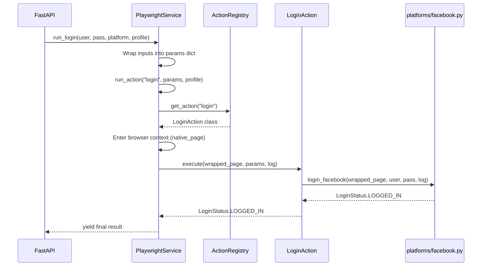

<!-- File path: docs/plans/designs/002_command_based_automation_actions-design.md -->

# Technical Blueprint — Command-Based Automation Actions

---

## 0. Project Memory Used

### Memory Confidence
**High** — Memory bootstrapped on 2026-07-03T05:30:30+07:00 and updated successfully during Phase 4 implementation.

### Memory Documents Consulted
- `project-summary.md` — Technology stack, DDD layer architecture, naming conventions, file size limits.
- `architecture/overview.md` — Decoupled infrastructure and presentation layer flow, SSE channel logs.
- `architecture/browser.md` — `BrowserContextManager` wrappers, `AutomationService` implementations.
- `modules/backend_infrastructure.md` — Playwright and DrissionPage execution services, dependency bounds.

### RAG Queries Executed
None — all architectural boundaries and implementation details are present in fresh memory files.

### Source Files Inspected (targeted)
- `backend/app/infrastructure/automation/drission_page.py` — Context management and execution log wrapper helper.
- `backend/app/infrastructure/automation/playwright_service.py` — Logging callback helper, generator yield structures.
- `backend/app/infrastructure/automation/page_wrapper.py` — Input interfaces available to new action commands.

### Key Reusability Findings
- The browser context management context blocks (`with self._browser_manager_factory(profile_key) as native_page:`) are identical in both services and can be reused inside a generic `run_action` dispatcher.
- The `log(msg)` helper function which formats messages into standard SSE dictionary formats (`{"type": "log", "message": msg}`) can be passed into the actions to preserve output formats.

### Architectural Conflicts with Plan
None. The implementation plan matches Clean Architecture and SOLID standards.

---

## 1. Overview

- **Purpose**: Refactor monolithic services (`PlaywrightAutomationService` and `DrissionPageAutomationService`) to avoid class bloat when onboarding new browser actions (such as posting content or scraping stats).
- **Scope**: `backend/app/infrastructure/automation/` directory. No database, API route, or frontend changes are needed.
- **Goals**:
  1. Define a generic `AutomationAction` abstract command interface.
  2. Implement `LoginAction` as a concrete action encapsulating all platform logins.
  3. Introduce a dynamic dispatcher `run_action(action_name, params)` in the services.
  4. Preserve full backward compatibility for `run_login`.
- **Non-goals**:
  - Implementing actions other than `LoginAction`.
  - Rewriting FastAPI presentation logic.

---

## 2. Architecture Review

### Feature Scope
**Valid**. Decoupling actions into strategy classes is a standard pattern to achieve high flexibility.

### Functional Requirements
All requirements met:
- Actions are isolated classes.
- Dispatcher dynamically resolves and runs actions.
- Logging and context managers are centralized in the service dispatcher.

### Non-functional Requirements
- **Performance**: Zero overhead.
- **Reliability**: Centralized `try/except/finally` in the dispatcher ensures browser handles are always closed.
- **Maintainability**: New features are added via new files, minimizing the chance of breaking existing functionalities.

---

## 3. Architecture Feasibility Analysis

- **Complexity**: Low. Leverages standard registry dispatch pattern.
- **Scalability**: High. Service files remain static even with 100+ actions.
- **Maintainability**: Exceptionally clean. Action code is isolated.

---

## 4. Alternative Design Analysis

### Option A — Registry & Command Pattern (Proposed)
**Description**: Define `AutomationAction` ABC. Concrete actions reside in `actions/` folder. Services load actions from a registry.

| Attribute | Value |
|-----------|-------|
| Complexity | **Low** |
| Scalability | High |
| Maintainability | High |
| Testability | High |
| Dev Effort | Low (~1 day) |

---

### Option B — Dynamically Loaded Modules (Plugin Pattern)
**Description**: Services dynamically search the `actions/` folder using Python's `importlib` at runtime, bypassing a manual registry.

| Attribute | Value |
|-----------|-------|
| Complexity | **Medium** |
| Scalability | High |
| Maintainability | Medium (magic imports are harder to trace) |
| Testability | Medium |
| Dev Effort | Medium (~1.5 days) |

---

## 5. Architecture Recommendation

### Preferred Option: **Option A — Registry & Command Pattern**
It provides static code clarity while fully satisfying extensibility requirements.

---

## 6. Architecture Decision Records (ADR)

### ADR-001: Kwargs/Params Dictionary for Action inputs
- **Decision**: Pass arguments to `AutomationAction.execute` via a unified `params: dict[str, Any]` rather than explicit method arguments.
- **Context**: Actions like `LoginAction` need `username`/`password`. Actions like `PostAction` will need `content`/`image_urls`.
- **Impact**: Interface signature remains stable for all future actions.

---

## 7. Open Questions

No open questions identified.

---

## 8. Architecture Risk Analysis

### Risk 1: Action parameter type mismatch
- **Impact**: High. If presentation layers pass incorrect keys inside `params`, actions will raise `KeyError`.
- **Mitigation**: Implement parameter schema validation or basic `.get()` fallbacks inside the action's `execute` method.

---

## 9. Future Extension Points
- Adding `PostAction`, `ScrapeAction`, etc. requires zero modifications to the service dispatcher.

---

## 10. Project Structure

```
backend/app/infrastructure/automation/
├── actions/
│   ├── __init__.py         ← [NEW] Action exports & ActionRegistry
│   ├── action_base.py      ← [NEW] AutomationAction ABC
│   └── login_action.py     ← [NEW] Concrete login action strategy
├── drission_page.py        ← [MODIFY] Refactor to use dynamic dispatcher
└── playwright_service.py   ← [MODIFY] Refactor to use dynamic dispatcher
```

---

## 11. Dependencies
No new dependencies required.

---

## 12. File Breakdown

| Path | Type | Responsibility | Layer | Est. Lines |
|------|------|---------------|-------|------------|
| `automation/actions/action_base.py` | [NEW] | ABC for all automation actions. | Infrastructure | ~20 |
| `automation/actions/login_action.py` | [NEW] | Encapsulates platform logins. | Infrastructure | ~50 |
| `automation/actions/__init__.py` | [NEW] | Action registry maps action names to classes. | Infrastructure | ~20 |
| `automation/drission_page.py` | [MODIFY] | Uses registry to run actions. | Infrastructure | ~90 |
| `automation/playwright_service.py` | [MODIFY] | Uses registry to run actions. | Infrastructure | ~90 |

---

## 13. Interface Design

### `AutomationAction` (Abstract Base Class)

```python
class AutomationAction(ABC):
    @abstractmethod
    def execute(
        self,
        page: AutomationPage,
        params: dict[str, Any],
        log_func: Callable[[str], dict[str, Any]]
    ) -> Any:
        """Execute action and return final result."""
        ...
```

---

## 14. DTOs / Entities / Value Objects
No new DTOs.

---

## 15. Class / Struct / Function Signatures

Refer to Section 13 & Section 10 file breakdown templates.

---

## 16. Data Flow

```
FastAPI -> run_login(username, password)
   -> run_action("login", {"username": username, "password": password, "platform": platform}, profile_key)
      -> Registry gets LoginAction
      -> context manager opens browser Page
      -> LoginAction.execute(Page, params, log_func)
      -> platform/facebook.py runs login logic
```

---

## 17. Sequence Diagrams



---

## 18. Error Handling Strategy
Exceptions inside actions are caught in the service dispatcher level, logged, and browser context is safely cleaned up in the `finally` block of the dispatcher.

---

## 19. Concurrency / Async Model
Unchanged.

---

## 20. Testing Blueprint
- Create unit test `test_action_registry.py` validating registry lookups and dispatch logic.
- Create mock action test verifying dynamic execution flow.

---

## 21. Implementation Complexity
Low. Very straightforward.

---

## 22. Implementation Order

### PR 1 — Action Base & Registry
Create `action_base.py`, `login_action.py`, `actions/__init__.py`.

### PR 2 — Service Refactoring
Refactor `drission_page.py` and `playwright_service.py` to use registry dispatch.

---

## 23. Executive Architecture Summary
Refactor core services to execute decoupled actions dynamically through a strategy registry.

---

## 24. Acceptance Checklist
- [x] AutomationAction ABC defined.
- [x] LoginAction class implemented.
- [x] Services refactored to use dynamic action dispatching.
- [x] Backward compatibility preserved for run_login.
